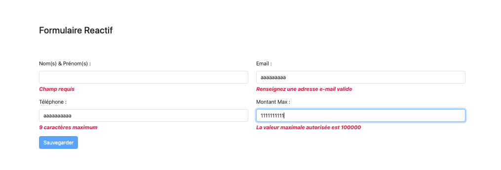

# Article Angular : Formulaires Réactifs et Validations

Ce projet a été généré avec [Angular CLI](https://github.com/angular/angular-cli) version 17.0.0.

## Introduction

Cet article explore de façon sommaire la mise en place de formulaires réactifs et de validations dans les applications Angular. Les formulaires réactifs offrent un moyen puissant et flexible de gérer les entrées utilisateur et de les valider.

## Dématrrage

Cloner le projet `git clone https://github.com/bibangjoseph/formulaire-reactif.git`.

Accéder au projet `cd formulaire-reactif`.

Installer les dépendances `npm install`.

Exécutez la commande `ng serve` pour un serveur de développement.

Accédez à `http://localhost:4200/`. L'application se rechargera automatiquement si vous modifiez l'un des fichiers source.

## Capture

## Contributions

Les contributions sous forme de suggestions, rapports de bogues et corrections sont les bienvenues! Si vous souhaitez contribuer à ce projet, veuillez soumettre une pull request après avoir suivi les directives de contribution
